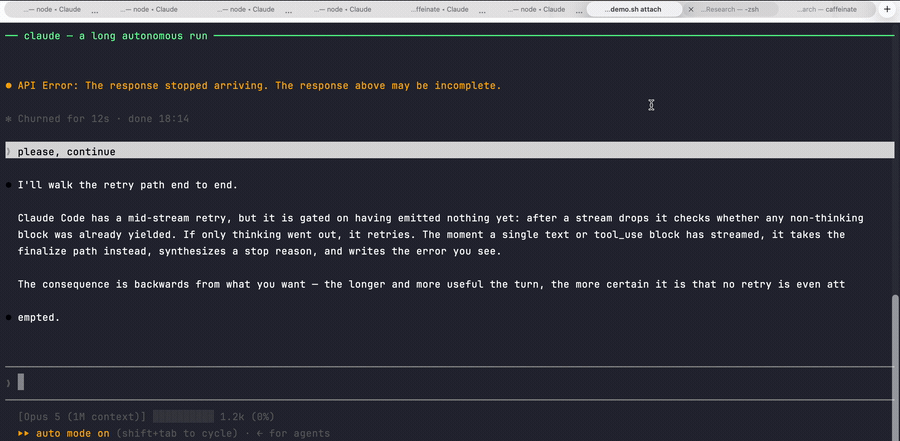

# cc-retry-watchdog

<p align="center">
  <b>Other tools let you see that Claude Code died.<br>
  This one brings it back while you were away.</b>
</p>

<p align="center">
  <b>English</b> | <a href="README.zh-CN.md">中文文档</a>
</p>

<p align="center">
  
  
  
  
  
</p>

<p align="center">
  
</p>

<p align="center">
  <sub>One cycle, replayed from a script so you do not have to wait for a real drop:
  the stream dies, and about a second later the retry is typed into that terminal.
  The log lines under <a href="#what-it-looks-like">What it looks like</a> are from real ones.</sub>
</p>

---

Claude Code stops dead when a response stream is cut mid-flight:

```
● API Error: Connection lost mid-response. The response above may be incomplete.
```

That is one of eleven wordings for the same event — see
[What counts as a drop](#what-counts-as-a-drop).

No countdown, no retry — the turn is finalized and the session sits there until a
human types something. On long autonomous runs this is the difference between
"came back to finished work" and "came back to a session that died 40 minutes ago".

This watchdog is that human. It notices the drop and types your retry prompt into
that exact terminal, and nothing else.

[Is this you?](#is-this-you) ·
[Why the built-in retry does not cover this](#why-the-built-in-retry-does-not-cover-this) ·
[What counts as a drop](#what-counts-as-a-drop) ·
[How this differs](#how-this-differs-from-the-other-claude-code-watchers) ·
[Install](#install) ·
[What it looks like](#what-it-looks-like) ·
[Supported terminals](#supported-terminals) ·
[How it decides](#how-it-decides) ·
[Configuration](#configuration)

---

## Is this you?

- Claude Code printed `API Error: Connection lost mid-response` and simply stopped.
- You came back an hour later and the session had been idle for fifty minutes.
- A long agentic run died halfway through and nothing retried it.
- You went looking for a Claude Code **auto-resume** or **auto-continue** setting
  and there isn't one.
- You exported `CLAUDE_CODE_AUTO_RESUME_ON_DROP` and nothing happened — it does
  not exist, and [here is why](#why-the-built-in-retry-does-not-cover-this).
- Your Mac's display slept overnight and you found `Your computer went to sleep
  mid-response` waiting for you in the morning.

If none of that looks familiar, this tool has nothing for you. It does one thing
and deliberately ignores every other kind of failure.

---

## Why the built-in retry does not cover this

Verified by string-inspecting the shipped binary (v2.1.226) and by reading local
transcripts, not by guessing:

**There is a mid-stream retry, but it is gated on having emitted nothing yet.**
After a stream drops, Claude Code checks whether any non-thinking block was
already yielded. If only thinking went out, it retries. The moment a single text
or `tool_use` block has streamed, it takes the finalize path instead, synthesizes
a stop reason, and writes the error you see. Limits are hardcoded (2 stale
connection retries, 1 idle timeout); no environment variable changes them.

The consequence is backwards from what you want: **the longer and more useful the
turn, the more certain it is that no retry is even attempted.**

**No hook can rescue it either.** A turn killed by an API error fires
`StopFailure`, not `Stop`. `StopFailure` is fire-and-forget — its stdout and exit
code are ignored — so the usual `{"decision": "block"}` trick that auto-continues
a `Stop` hook does nothing here.

**The timeout knobs are real but irrelevant.** `CLAUDE_ENABLE_BYTE_WATCHDOG`,
`CLAUDE_BYTE_STREAM_IDLE_TIMEOUT_MS`, `CLAUDE_ENABLE_STREAM_WATCHDOG`,
`CLAUDE_STREAM_IDLE_TIMEOUT_MS` and `keepPartialMessageOnAbort` all exist in the
binary. They control *detection*. They cannot re-issue a turn.

**`CLAUDE_CODE_AUTO_RESUME_ON_DROP` does not exist.** It appears in
[anthropics/claude-code#69415](https://github.com/anthropics/claude-code/issues/69415)
as a *proposal*. It is not in the binary; exporting it does nothing. (Check your
own build: `strings -a "$(readlink -f "$(command -v claude)")" | grep AUTO_RESUME`.)

One local data point on cause: across 160 drops the time-to-failure had a median
of 22s and a max of 203s, with no clustering at the 180s/300s watchdog thresholds
— consistent with the network path cutting the connection rather than a watchdog
aborting it. Tuning those timeouts is not the fix.

---

## What counts as a drop

The trigger is an allowlist of exact messages, taken from the strings compiled
into the `claude` binary rather than from what happened to appear on someone's
screen. Claude Code rewrote this message set in **2.1.226** — `closed` became
`lost`, and the two generic messages split into one per cause — so both
generations are matched and an upgrade or rollback changes nothing:

| ≤ 2.1.225 | ≥ 2.1.227 |
|---|---|
| `Response stalled mid-stream` | `The response stopped arriving` |
| `Connection closed mid-response` | `Connection lost mid-response` |
| `Server error mid-response` | `Server error mid-response` |
| — | `Your computer went to sleep mid-response` |

Those finalize a turn that had already streamed something, so they end in *"The
response above may be incomplete."* The same failures before any content is
produced end in *"Try again."* and are matched too — `Response stalled while
thinking` / `Connection closed while thinking` on the old build, `The response
stalled` / `Connection lost` / `Your computer went to sleep before a response was
produced` on the new one — along with `Connection to the API was lost (<code>)`,
which is raised around the stream rather than inside it.

Deliberately **not** matched, because a retry would only burn a turn:
`Request was aborted` (you pressed esc), `401 Invalid API key`, the `400`s for
tool-use concurrency and duplicate `tool_use` IDs, `The model has reached its
context window limit`, and the bare `Please wait a moment and try again`
fallback. The match never keys on the `API Error:` prefix alone.

To re-derive the list after an upgrade, see the header of
`tests/test_messages.py`.

---

## How this differs from the other Claude Code watchers

Several tools watch Claude Code. Almost all of them answer *"what is it doing
right now?"* — a status line, a dashboard, a phone or watch notification. This one
answers a different question: *"it died while I was away; who types the retry?"*

| Tool class | What it does on a mid-stream drop |
|---|---|
| Status lines, dashboards, watch apps | show the session as `Error` |
| Wrapper-level retry tools | retry rate limits and 5xx, from outside the CLI |
| This | detect the drop, decide it is safe, and type into that exact terminal |

Three things worth knowing before you pick:

- **It is an actuator, not a display.** Seeing the error is not the same as being
  rescued — and you are reading this because you were not at the keyboard.
- **It covers one failure class and only that one.** Not rate limits, not 5xx, not
  usage caps; those already have retry paths. It covers the drop the built-in
  retry structurally cannot take — see
  [Why the built-in retry does not cover this](#why-the-built-in-retry-does-not-cover-this).
- **Most of the work is in refusing to act.** Over half the cases across the three
  test suites are must-not-fire. A dashboard that mislabels a session costs nothing;
  typing into a live session costs a turn — and once cost a real session nine and
  a half hours.

It does not conflict with any of them. Run them alongside it if you like; the
`sessions.json` snapshot each sweep writes is there for exactly that.

---

## Install

```bash
git clone https://github.com/S313S/cc-retry-watchdog.git ~/.cc-retry-watchdog && \
  ~/.cc-retry-watchdog/install.sh --hook
```

One line, nothing to uninstall but that directory. Omit `--hook` to have the
snippet printed instead of `settings.json` edited. Clone it wherever you like —
the installer symlinks `ccwatch` from wherever the checkout sits.

Requires Python 3.6+ (stdlib only, no packages). `--hook` backs up
`~/.claude/settings.json` before touching it and is idempotent.

```bash
ccwatch check     # what does it think of your terminals right now? never injects
ccwatch start     # start the watchdog
ccwatch hook      # is the hook registered? any pending tickets?
```

Claude Code sessions **already running** will not load a newly added hook until
they restart. They still get the polling fallback in the meantime.

---

## What it looks like

Nothing at all, when it is working — which is the point. The evidence is in
`~/.claude/cc-autoresume/watchdog.log`:

```
[01:05:10] SENT[hook] Terminal:44939:1 | /dev/ttys000 | MarketingResearch — … | retry #1
[01:22:47] ticket held | /dev/ttys000 | stood down at the last moment: session busy (Retrying in Ns)
[12:03:05] CLEARED a stalled 'please, continue' from the input box | Terminal:45611:1 | /dev/ttys005 | OK
[01:31:36] ticket held | /dev/ttys004 | ok: input box not empty (continue), skipping; unchanged for 92s of the 120s grace
[01:32:04] CLEARED an abandoned 'continue' from the input box | Terminal:118693:1 | /dev/ttys004 | OK
```

Line one is a rescue, one second after the drop. Line two is the watchdog
*refusing* to type, because that session had started recovering on its own and
interrupting it would have cost the turn. Line three is it repairing an earlier
injection of its own that never made it out of the input box.

Lines four and five are the same repair for text that was not ours: the box had
been holding `continue` since before the stream died, the grace ran out with
nobody touching it, and it was cleared so the next sweep could rescue the
session. The text is quoted in the log on purpose — that is how you get a queued
message back if one is ever cleared out from under you.

---

## Supported terminals

| Platform | Backend | Status |
|---|---|---|
| macOS — Terminal.app | AppleScript | tested |
| macOS — iTerm2 | AppleScript | tested |
| any — tmux | `capture-pane` / `send-keys` | tested |
| Linux / WSL / Windows without tmux | — | not supported |
| VS Code integrated terminal | — | not supported |

Off macOS, tmux is the only way in: there has to be some way to read a terminal's
screen and type into it, and tmux is the portable one.

**macOS: start it from a real terminal window.** Driving Terminal/iTerm needs
AppleScript automation rights, which are granted to the *responsible* app. A
process spawned by launchd has no such identity and its AppleEvents hang forever,
so there is no LaunchAgent here on purpose. tmux-only setups are unaffected.

### Starting it automatically

Since it has to come from a terminal window anyway, let the first terminal you
open do it. Add to `~/.zshrc` (or `~/.bashrc`):

```bash
[[ -o interactive ]] && command -v ccwatch >/dev/null 2>&1 && ccwatch autostart
```

`autostart` is silent, costs nothing when the watchdog is already up, and
refuses to run from a shell with no controlling tty — a sandboxed tool shell, a
CI step, a hook. That guard matters: a watchdog started without a terminal
parent would sit there timing out on every AppleEvent while holding the pidfile
a healthy one needs.

The daemon survives closing the window that started it. It does not survive a
logout or reboot, which is exactly what the rc line covers.

---

## How it decides

Two independent paths.

**1. StopFailure hook — accurate, ~1s.** The hook cannot resume the turn, but it
can leave a ticket naming the tty that just died. The watchdog acts on it within
a second. No screen-reading involved; the drop is a known fact.

A background job is the awkward case. Its turn does not run in the terminal tab
you watch it through: the CLI daemon hosts it in a `claude bg-spare` process on a
pty of its own, and that pty is what the hook finds when it walks up its parents.
So the ticket arrives naming a tty no window owns. The job's state file under
`~/.claude/jobs/<id>/` is the only bridge — it carries both the session id on the
ticket and the task name the tab's title is built from — so the ticket is moved
onto the tab showing that job. Two tabs that could be it, or none, and the ticket
is left to expire rather than guessed at; the polling path sees the same screen a
few seconds later anyway.

**2. Screen polling — fallback, ~5s.** Reads what each terminal shows and
recognizes the layout of a session parked on the error. Covers sessions that
started before the hook was installed, and the case where the daemon was down.

Either way it refuses to act unless **all** of these hold:

- the error is the last thing that happened this turn (polling), or a ticket says
  so (hook);
- the session is idle — no spinner, no `esc to interrupt`, and crucially no
  built-in `Retrying in Ns · attempt n/m`, so it never interrupts self-recovery;
- the input box is empty, so half-typed text is never clobbered — the one
  exception is text a ticket proves was left there before the drop and
  abandoned since, which is [cleared rather than typed
  over](#when-the-box-holds-somebody-elses-leftover);
- a claude process is actually running there;
- cooldown elapsed (30s) and the per-session retry cap (6) is not exhausted;
- and all of it still holds at the instant of typing. The one tab is re-read
  immediately before the keystrokes go out, because a session can wake inside
  that gap — a task notification from a background agent is enough. Typing into
  a session that just woke leaves the text sitting *unsubmitted* in its input
  box, and a non-empty input box is exactly what this refuses to touch: one
  mistimed injection would shield the session from every later rescue.

Situations it deliberately ignores: a turn that finished normally and is waiting
for you, a session that already recovered and kept writing, a permission prompt,
a subagent error while the main loop runs on, and the error text merely appearing
in conversation.

A background agent that outlives the dead turn is *not* one of them. Its panel
keeps drawing under the error long after the main loop is parked, which used to
read as "the turn moved on" and left the fallback blind — one real drop sat
unretried for eleven hours that way. That chrome is now recognized; anything the
main loop itself emits after the error still disqualifies the session.

### When an injection stalls

The last-moment re-check above has a failure mode of its own. `do script` hands Terminal.app
the text and the return in a single write, and a TUI can take that for a paste:
the text lands in the input box and nothing is submitted. The box is then
non-empty forever — which is exactly what the watchdog refuses to type into, so
**one mistimed injection shields the session from every later rescue.** That is
not hypothetical; it cost a real session nine and a half hours parked on a drop,
with the log correctly reporting `input box not empty` every second of it.

So a box holding *exactly* the retry text, on a session that otherwise wants
rescuing, is recognized as a stalled injection of our own and cleared with
Ctrl-U; the pending ticket is deliberately left alone, and the next sweep
injects normally. Equality, not containment: text the user typed that merely
starts with or contains the retry prompt is theirs, and is never touched.
Pressing return again — the obvious alternative — does not submit a box in this
state; that was tried against a live session before Ctrl-U was.

### When the box holds somebody else's leftover

Equality covers our own text and nothing else, and the same shield goes up
behind *any* stray line. A real drop went unrescued on 2026-09-06 with the box
holding the word `continue`: the ticket arrived on time, the watchdog held for
the right reason, and three minutes later the ticket expired.

Nothing about the *text* separates a leftover from a message queued while Claude
was working, so the judgement is made on time alone, and only with a ticket in
hand:

* the text was **already in the box when the stream died** — so it is not a
  reply the user is typing to the error they just watched appear; and
* it has **not changed in `stale_box_grace_sec` since the drop** — so nobody is
  at the keyboard. A queued message has an author who reacts to a dead session
  within a minute or two. Any edit at all, however small, restarts that clock.

Then it is cleared with Ctrl-U, once, and the next sweep injects normally. The
text goes into the log on its way out, so a queued message clipped by mistake
can be read back and re-sent — and setting `stale_box_grace_sec` to `0` turns
the whole behaviour off, leaving only the exact-equality case above.

The trade is deliberate and it is not free: a message you queued and walked away
from for two minutes can be discarded in favour of the retry. Weigh that against
the alternative, which is the session sitting parked until you happen to look at
it.

Four suites pin all of this. Run them after changing any pattern:

```bash
python3 tests/test_analyze.py       # 44 hand-reproduced terminal layouts
python3 tests/test_messages.py      # 25 real CLI strings, fire vs must-not-fire
python3 tests/test_tickets.py       # 17 cases on claiming a background job's ticket
python3 tests/test_abandoned_box.py # 45 cases on clearing a box, and on not clearing it
```

Over half of the cases in each are "must not fire" — that is the side where a
bug costs something, since a false positive types into a session you are using.

---

## Caveat worth understanding

Typing anything into a dead turn starts **a new turn**. The default text is
`please, continue` — worded that way on purpose, since `please, retry` reads as
"start over" — and because the partial response stays in the transcript, the
model usually picks up where it was cut off. But it is still a fresh turn: if the
drop happened after an `Edit` or `Bash` call, the model may repeat that side
effect. This is inherent to recovering by re-prompting, not something this tool
adds; automating it just makes it happen more often. Set
`max_consecutive` low if that worries you, or run with `dry_run` first.

---

## Configuration

`~/.claude/cc-autoresume/config.json`, re-read live — no restart needed.

| Key | Default | Meaning |
|---|---|---|
| `retry_text` | `please, continue` | what gets typed |
| `poll_interval_sec` | `5` | polling cadence |
| `confirm_polls` | `2` | consecutive stuck observations before acting (polling path only) |
| `cooldown_sec` | `30` | minimum gap between injections into one session |
| `max_consecutive` | `6` | per-session retry cap; then it stops and waits for a human |
| `dry_run` | `false` | log what it would do, inject nothing |
| `notify` | `true` | desktop notification on injection (macOS) |
| `use_hook_triggers` | `true` | trust tickets from the StopFailure hook |
| `trigger_ttl_sec` | `180` | tickets older than this are discarded |
| `fast_poll_sec` | `1` | cadence while a ticket is pending |
| `stale_box_grace_sec` | `120` | how long text must sit in the input box, unchanged, after a drop before it counts as abandoned and is cleared — see [When the box holds somebody else's leftover](#when-the-box-holds-somebody-elses-leftover). `0` disables it. Must be comfortably under `trigger_ttl_sec`, or every ticket expires first; the log warns once if it is not |
| `exclude_title_regex` | `""` | skip sessions whose title matches |
| `exclude_tty` | `[]` | e.g. `["/dev/ttys003"]` |
| `watch_terminal_app` / `watch_iterm` / `watch_tmux` | `true` | per-backend switches |
| `tail_lines` | `80` | how much of the screen bottom to inspect |
| `snapshot` | `true` | write `sessions.json` after every sweep — see [For other tools](#for-other-tools) |

State, logs and tickets live in `~/.claude/cc-autoresume/` (override with
`CC_AUTORESUME_HOME`), deliberately outside the checkout so `git pull` never
fights with them.

---

## For other tools

The watchdog is the one process that already reads every terminal, so after
each sweep it publishes what it saw to `~/.claude/cc-autoresume/sessions.json`
(written atomically; `snapshot: false` turns it off):

```json
{"ts": 1724570005.1, "pid": 48211, "sessions": [
  {"sid": "Terminal:44939:1", "app": "Terminal", "key": "44939:1", "tty": "/dev/ttys000",
   "title": "proj-a — claude", "state": "working", "since": 1724569980.4,
   "verdict": "ok: session busy (esc to interrupt)"}
]}
```

`state` is one of `working` · `idle` (turn over, waiting for a human) · `typing`
(input box not empty) · `dropped` (parked on a drop, retry in progress) ·
`gave_up` (retry cap hit — needs a human) · `skipped` · `not_claude_ui`.
`since` is when the session entered that state; `verdict` is the exact reason
from the sweep, the same text `ccwatch check` prints.

This is strictly an output — nothing in the retry decision reads it back. It
exists so a companion tool can answer *"which terminal is waiting for me?"*
without running a second AppleScript sweep of its own; that tool is
[cc-needs-you](https://github.com/S313S/cc-needs-you).

---

## Implementation notes

Things that cost real debugging time, recorded so nobody repeats them:

- **A ticket must never expire without saying why.** A pending ticket that is
  held back logs its reason (`ticket held | <tty> | <reason>`) each time that
  reason changes, and the expiry line repeats the last verdict. Before that, a
  missed drop left nothing in the log but `expired`, and no way to tell whether
  the session had looked busy, unrecognized, or absent.
- **Terminal.app's scripting dictionary fails silently, twice.**
  `repeat with w in windows` yields nothing — you must index `window wi`. And
  `set tb to tab ti of window wi` followed by `contents of tb` returns empty —
  the full specifier has to be repeated. AppleScript's `try` swallows both, so
  the watchdog explicitly warns when a running app yields zero sessions.
- **A tty is not a unique session key.** A Terminal window whose process exited
  still reports its old tty, and that number gets recycled by new windows. Two
  entries then collide and overwrite each other's counters, so the debounce never
  converges. Key on `window id : tab index` instead.
- **The hook process has no controlling terminal** (`ps` shows `??`). The tty must
  be found by walking up the parent chain.
- **The hook payload's `error` field is only a coarse class** — a mid-stream drop
  and a 502 both arrive as `"server_error"`. The real message is in
  `last_assistant_message`.
- **Send the text and the Return separately where the terminal lets you.** A TUI
  that receives both in one read may take it for a paste and leave the text
  sitting in the input box, unsubmitted. iTerm2 and tmux can send them apart;
  Terminal.app's `do script` cannot, which is why a stalled injection has to be
  recognized and cleared after the fact instead. Pressing Return again is not
  the fix — that was tried against a live session, and it does not submit.
- **AppleScript keystroke simulation is not an option** unless the user has
  granted osascript Accessibility rights; `System Events` keystroke fails with
  "osascript is not allowed to send keystrokes". Everything here goes through each
  terminal's own scripting interface instead.

---

## Credits

Grew out of [anthropics/claude-code#69415](https://github.com/anthropics/claude-code/issues/69415),
where the `StopFailure` behaviour and the undocumented watchdog environment
variables were first dug out of the binary. Everything here runs outside Claude Code and
changes nothing inside it, so it behaves the same whether or not an official
auto-resume ever lands.

MIT licensed.
